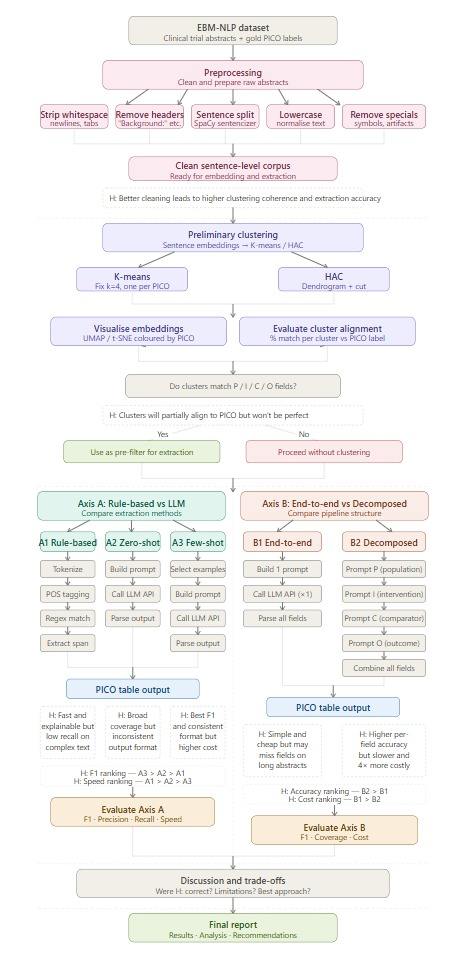
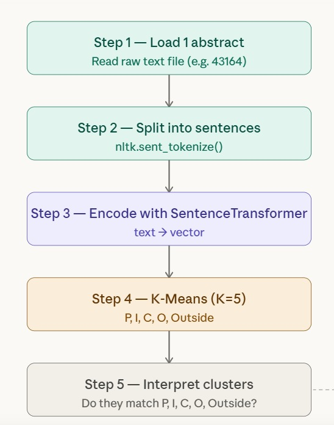

Overview

Chenyu Yuan
- Working on clustering approaches: Before extraction, use k-means or Hierarchical clustering (HAC) on sentence embeddings to see whether natural clusters
correspond to schema fields.:-

-------------------------------------------------------------------------------------------------------------------------------------------------------------------------------
Mew Yongvibulsiri and Nachiket Gondane
- Design and implement an information extraction pipeline: Working on axes 1;
rule-based approaches versus LLMs. :-
1.
-------------------------------------------------------------------------------------------------------------------------------------------------------------------------------
Priyanshu Gurjar and Vikrant Nitin Deshmukh
- Design and implement an information extraction pipeline: Working on axes 2;
end-to-end models versus decomposing. :-
1.Decomposing : Priyanshu
2.end-to-end : Vikrant

